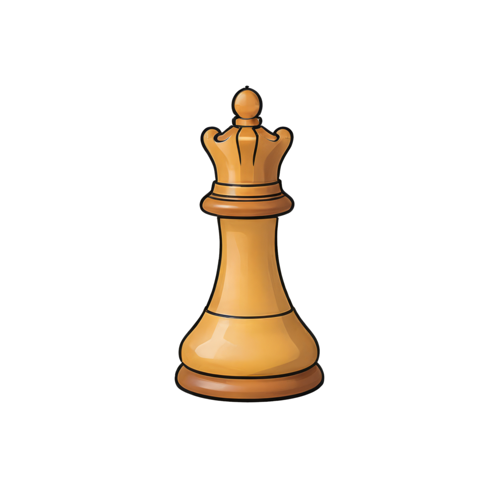

<!-- Improved compatibility of back to top link -->

<a id="readme-top"></a>

<!-- PROJECT LOGO -->

<br />
<div align="center">
  
  <h3 align="center">Chess Elo Prediction</h3>
  <p align="center">
    A project for predicting chess Elo ratings using game features and machine learning algorithms.
  </p>
</div>

## About The Project

The Chess Elo Prediction project aims to predict chess Elo ratings based on various game features. The model takes features from historical chess games and uses machine learning techniques to estimate the Elo rating of players. The project is modular and designed for easy expansion with different models and features.

### Built With

* [Python](https://www.python.org/)
* [Pandas](https://pandas.pydata.org/)
* [NumPy](https://numpy.org/)
* [Scikit-learn](https://scikit-learn.org/stable/)
* [Matplotlib](https://matplotlib.org/)
* [Seaborn](https://seaborn.pydata.org/)

<p align="right">(<a href="#readme-top">back to top</a>)</p>

---

## Getting Started

### Prerequisites

* Python 3.8+
* pip or conda

### Installation

1. Clone the repo

   ```bash
   git clone https://github.com/yourusername/chess-elo-prediction.git
   cd chess-elo-prediction
   ```

2. Download the dataset from the [Kaggle Chess Elo dataset](https://www.kaggle.com/datasets) (search for "Chess Elo Rating Prediction") and place the cleaned chess data in the `data/` directory (ensure the dataset is properly formatted, including the CSV file with game features and Elo ratings).

3. Create a virtual environment & install dependencies

   ```bash
   python -m venv venv
   source venv/bin/activate  # On Windows use: venv\Scripts\activate
   pip install -r requirements.txt
   ```

<p align="right">(<a href="#readme-top">back to top</a>)</p>

---

## Usage

### Data Preprocessing & Feature Engineering

Run the preprocessing and feature extraction scripts:

```bash
python data_cleaning.py
python feature_engineering.py
```

### Train the Model

Run the model training script:

```bash
python model_training.py
```

### Evaluate the Model

Evaluate the trained model on the test set:

```bash
python evaluation.py
```

All necessary files and data should be placed in:

```
data/
├── cleaned_chess_data.csv
└── other_required_data_files.csv
```

<p align="right">(<a href="#readme-top">back to top</a>)</p>

---

## License

Distributed under the MIT License. See `LICENSE` for more information.

<p align="right">(<a href="#readme-top">back to top</a>)</p>

---

## Acknowledgments

* [Chess Elo Rating System](https://en.wikipedia.org/wiki/Elo_rating_system)

<p align="right">(<a href="#readme-top">back to top</a>)</p>

<!-- MARKDOWN LINKS -->

[contributors-shield]: https://img.shields.io/github/contributors/yourusername/chess-elo-prediction.svg?style=for-the-badge
[contributors-url]: https://github.com/yourusername/chess-elo-prediction/graphs/contributors
[forks-shield]: https://img.shields.io/github/forks/yourusername/chess-elo-prediction.svg?style=for-the-badge
[forks-url]: https://github.com/yourusername/chess-elo-prediction/network/members
[stars-shield]: https://img.shields.io/github/stars/yourusername/chess-elo-prediction.svg?style=for-the-badge
[stars-url]: https://github.com/yourusername/chess-elo-prediction/stargazers
[issues-shield]: https://img.shields.io/github/issues/yourusername/chess-elo-prediction.svg?style=for-the-badge
[issues-url]: https://github.com/yourusername/chess-elo-prediction/issues
[license-shield]: https://img.shields.io/github/license/yourusername/chess-elo-prediction.svg?style=for-the-badge
[license-url]: https://github.com/yourusername/chess-elo-prediction/blob/main/LICENSE
[linkedin-shield]: https://img.shields.io/badge/-LinkedIn-black.svg?style=for-the-badge&logo=linkedin&colorB=555
[linkedin-url]: https://www.linkedin.com/in/mauriciovillavicencio


